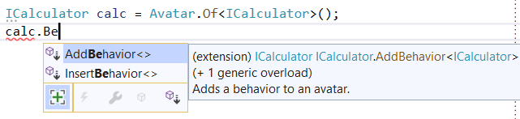
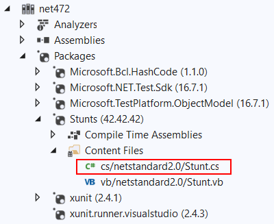
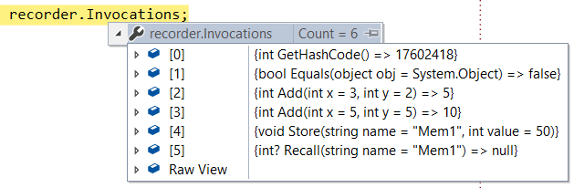
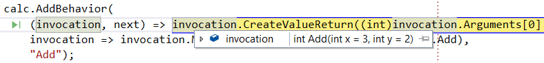

<h1 id="stunts"> Stunts</h1>

A modern interception library that runs everywhere, even where run-time code generation (Reflection.Emit) is forbidden or limitted (i.e. physical iOS devices and game consoles), through compile-time code generation.

> The **Stunts** name was inspired by the [Test Double](http://xunitpatterns.com/Test%20Double.html) naming in the mock objects literature, which in turn comes from the [Stunt Double](https://en.wikipedia.org/wiki/Stunt_double) concept from film making. This project allows your objects to pull arbitrary *stunts* based on your instructions/choreography 😉.

Stunts essentially implements the [proxy design pattern](https://en.wikipedia.org/wiki/Proxy_pattern) and adds the capability of configuring those proxies via code using what we call a *behavior pipeline*. 

> NOTE: Stunts is a fairly low-level API, which enables higher-level APIs (like the upcoming Moq vNext API) to be based on top of it.

## Requirements:

Stunts is a .NET Standard 2.0 library and runs on any runtime that supports that. 

Compile-time proxy generation leverage [Roslyn source generators](https://github.com/dotnet/roslyn/blob/master/docs/features/source-generators.cookbook.md) and therefore requires C# 9.0, which at this time is included in Visual Studio 16.8 (preview or later) and the .NET 5.0 SDK (RC or later). Compile-time generated proxies support the broadest possible run-time platforms since they don't require any Reflection.Emit, and also don't pay that performance cost either.

Whenever compile-time proxy generation is not available, you can install the Stunt.DynamicProxy package which leverages [Castle DynamicProxy](https://github.com/castleproject/Core/blob/master/docs/dynamicproxy-introduction.md) to provide the run-time code generation.

The client API for configuring proxy behaviors in either case is exactly the same. 

> NOTE: even though generated proxies is the main usage for Stunts, the API was designed so that you can also consume the behavior pipeline easily from hand-coded proxies too.

## Usage

```csharp
ICalculator calc = Stunt.Of<ICalculator>();

calc.AddBehavior((invocation, next) => ...);
```

`AddBehavior`/`InsertBehavior` overloads allow granular control of the stunt's behavior pipeline, which basically a [chain of responsibility](https://en.wikipedia.org/wiki/Chain-of-responsibility_pattern) that invokes all configured behaviors that apply to the current invocation. Individual behaviors can determine whether to short-circuit the call or call the next behavior in the chain. 



Behaviors can also dynamically determine whether they apply to a given invocation by providing the optional `appliesTo` argument when registering a behavior. In addition to the  delegate-based overloads (called *anonymous behaviors*), you can also create behaviors by implementing the `IStuntBehavior` interface:

```csharp
public interface IStuntBehavior
{
    bool AppliesTo(IMethodInvocation invocation);
    IMethodReturn Execute(IMethodInvocation invocation, GetNextBehavior next);
}
```

## Common Behaviors

Some commonly used behaviors that are generally useful are provided in the library and can be added to stunts as needed:

* `DefaultValueBehavior`: sets default values for method return and *out* arguments. In addition to the built-in supported default values, additional default value factories can be registered for any type.

* `DefaultEqualityBehavior`: implements the *Object.Equals* and *Object.GetHashCode* members just like *System.Object* implements them.

* `RecordingBehavior`: simple behavior that keeps track of all invocations, for troubleshooting or reporting.

## Customizing Stunt Creation

If you want to centrally configure all your stunts, the easiest way is to simply provide your own factory method (i.e. `Stub.Of<T>`), which in turn calls the `Stunt.Of<T>` provided. For example:

```csharp
    public static class Stub
    {
        [StuntGenerator]
        public static T Of<T>() => Stunt.Of<T>()
            .AddBehavior(new RecordingBehavior())
            .AddBehavior(new DefaultEqualityBehavior())
            .AddBehavior(new DefaultValueBehavior());
    }
```

The `[StuntGenerator]` attribute is required if you want to leverage the built-in compile-time code generation (i.e. you are not using the *Stunts.DynamicProxy* package), since that flags the source generator that calls to your API end up creating a stunt and therefore a generated type will be needed for it during compile-time. You can actually explore how this very same behavior is implemented in the built-in Stunts API which is provided as content files:



The `Stunts.cs` contains, for example:

```csharp
[StuntGenerator]
public static T Of<T>(params object[] constructorArgs) => Create<T>(constructorArgs);

[StuntGenerator]
public static T Of<T, T1>(params object[] constructorArgs) => Create<T>(constructorArgs, typeof(T1));
```

As you can see, the Stunts API itself uses the same extensibility mechanism that your own custom factory methods can use.


## Debugging Optimizations

There is nothing more frustrating than a proxy/stunt you have carefully configured that doesn't behave the way you expect it to. In order to make this a less frustrating experience, Stunts is carefully optimized for debugger display and inspection, so that it's clear what behaviors are configured and invocations and results are displayed clearly and concisely. Here's the debugging display of the `RecordingBehavior` that just keeps track of invocations and their return values for example:



And here's the invocation debugger display when debugging an anonymous behavior:




## Samples

The `samples` folder in the repository contains a few interesting examples of how Stunts can be used to implement some fancy use cases. For example:

* Forwarding calls to matching interface methods/properties (by signature) to a static class. The example uses this to wrap calls to *System.Console* via an *IConsole* interface.

* Forwarding calls to a target object using the DLR (that backs the *dynamic* keyword in C#) API for high-performance late binding. 
 
* Logging all calls to a stunt to the Xunit output helper.